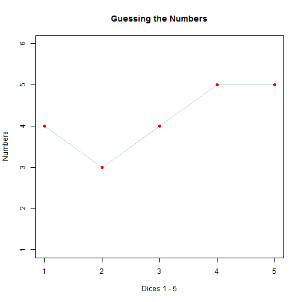

## Slide 2: Guessing the Dice

In this application five dice are thrown and your task is to guess what
numbers were thrown.

Let's have a look:

```r
code <- sample.int(6, 5, replace = T)
print(code)
```

```
## [1] 4 3 4 5 5
```


So there are 5 numbers from 1 to 6 which are to guess.

You could do the guessing with the 5 sliders on the left side
of the application.


---

## Slide 3: The Information on the Right Side

On the right side is a line-point diagram, in which you can see your guesses. They reflect the position of the sliders. Let's have a look:

 


---

## Slide 4: The Information Given:

* The number of correct guessed dice (in number and position)

```
## [1] "code:   4 3 4 5 5"
```

```
## [1] "guess:  4 3 6 1 1"
```

```
## [1] "correct numbers:  2"
```


* The number of correct guessed dice, if everything is in increasing order:

```
## [1] "sort(code) :  3 4 4 5 5"
```

```
## [1] "sort(guess):  1 1 3 4 6"
```

```
## [1] "correct numbers, if in order:  0"
```


---

## Slide 5: Ideas for Changes in the Game

This game is only a little example for a shiny project.
But it could be enhanced with other features in further development:

* Of course the solution must not be given. This was only for illustration.

* There could be a prediction whether the dice are biased or not.

* There could be information how many even numbers and how many odd numbers are tossed.

* If the tossing continues, there could be a guess, what the next number tossed will be. This could be based on a Naive Bayes probability.
